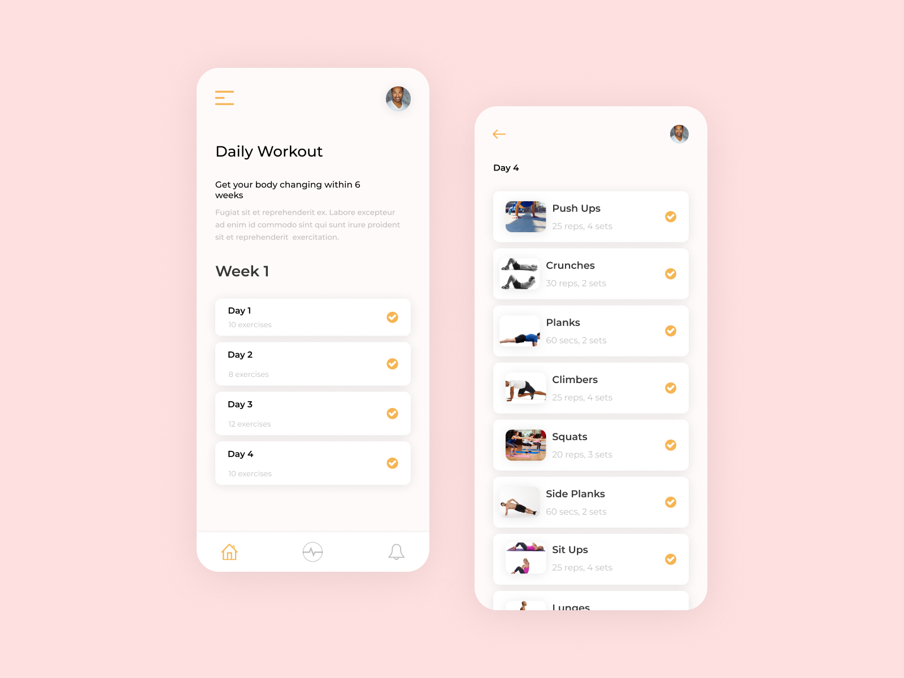

# Flutter Workout UI

A new Flutter project inspired by Farouk Muhammed (https:&#x2F;&#x2F;dribbble.com&#x2F;misterfarouk)

## Getting Started

This project is a starting point for a Flutter application.

A few resources to get you started if this is your first Flutter project:

- [UI designed by Farouk Muhammed](https://dribbble.com/misterfarouk)
- [Icons made by Dara](https://www.flaticon.com/authors/ddara)

For help getting started with Flutter, view our
[online documentation](https://flutter.dev/docs), which offers tutorials,
samples, guidance on mobile development, and a full API reference.

#Screenshot
